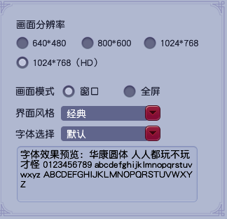

# mhxy-escort

## 介绍

机器学习实践-梦幻西游战斗弹窗、成语弹窗、移动弹窗

核心功能：

1. 战斗弹窗：四个小人中选择一个朝向正面的。

   实现方式：利用tensorflow训练一个卷积神经网络(cnn), 识别图片中人物的正或反

2. 成语弹窗：根据给定的弹窗信息，点选成语, 如图 (1) 所示。

   实现方式：目标检测模型+孪生神经网络，检测成语的四个字，依次判断每个字是否要点击的哪个字

3. 移动弹窗:   根据给定的弹窗信息，选择移动的"x"，如图(2) 所示。

   

   ​																									图（1)

   ​																			

   

   ​																									图（2）

## 免责声明

为了避免脚本被用于谋利，提供的模型为精度较低版本的模型，**欢迎star**。

使用本项目仅供学习交流使用，所涉及到的游戏行为都有可能违反相关游戏厂商或服务提供商的规定，作者不对此类行为产生的后果承担任何责任。用户应在风险自负的前提下自行判断和使用本项目，并且应遵守所有相关法律法规。

此外，该版本自动化实现的鼠标移动、点击等行为在此未进行拟人模拟，且点击及键盘事件不是在驱动层实现的行为，使用有风险，仅供学习交流使用。

## 环境描述

Windows

```
C:\Users\xxx>ver

Microsoft Windows [版本 10.0.19044.1466]
```

Python

```
C:\Users\SF>python --version
Python 3.8.10
```

屏幕分辨率

```
1920*1080  屏幕无缩放
```

梦幻西游



## 运行

成语弹窗、移动弹窗点击

```
python src/modules/check.py
```

点击战斗弹窗

```
python src/modules/autoFight.py
```

## 目录结构

assets: 模板匹配相关资源图片

game_models: 模型文件，正反分类模型，文字检测模型，图片相似度对比模型

nets: 孪生相关网络

script_utils,siamese_utils:  小工具

src： 组件包括地图定位，路径搜索，鼠标移动，截图，弹窗识别、自动战斗等功能

config:：脚本启动配置

## 法律声明

本人无任何商业目的，仅用于学习和娱乐，本项目采用了 MIT 开源许可证，详细信息请参见许可证文件。该许可证允许任何人复制、分发、修改和销售本项目副本，但不提供任何担保或条件。如果您使用本项目，则表示您同意遵守 MIT 许可证的规定，并承认本项目的所有权归作者所有。如果您不同意这些条款，请勿使用本项目。

